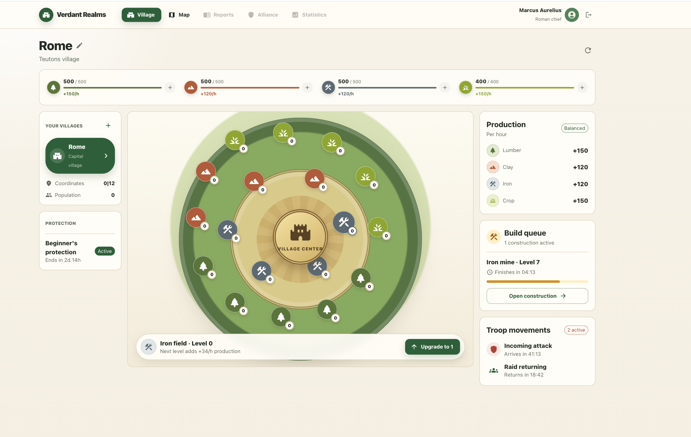
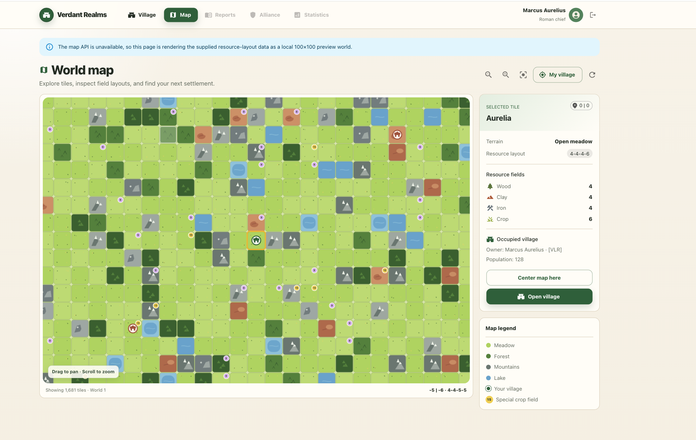
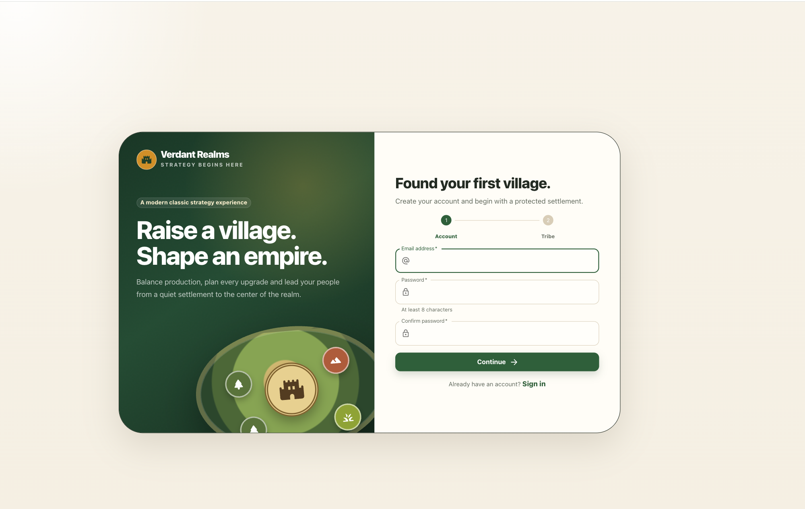

# Vallorium

**Game:** https://vallorium.online  
**Swagger / API docs:** https://vallorium.online/api/docs

<p align="center">
  <a href="https://vallorium.online/">
    
  </a>
</p>

**Vallorium** is a persistent, browser-based multiplayer strategy game inspired by [Travian](https://www.travian.com/).

<p align="center">
  <a href="https://vallorium.online/">
    
  </a>
</p>

<p align="center">
  <a href="https://vallorium.online/">
    
  </a>
</p>

<p align="center">
  <a href="https://vallorium.online/">
    
  </a>
</p>

A village contains 18 resource fields producing four resources:

- 🌾 Crop
- ⛓️ Iron
- 🪵 Wood
- 🧱 Clay

Resource fields can be upgraded to increase production. Players can also build, upgrade, and demolish structures in their village as their economy and strategy evolve.

Expansion is a major part of the game. Players can:

- Found new villages on unclaimed land
- Build armies with tribe-specific units
- Attack other players
- Conquer enemy villages

---

## 🗄️ Local Development

### Requirements

Make sure you have:

- Docker
- Docker Compose

From the repository:

```bash
cd vallorium
```

Run the initial database migration:

```bash
docker compose run migrate
```

Then start the application:

```bash
docker compose up
```

The initialization process creates the database schema and populates the required reference data.

### Local frontend/API routing

The frontend calls the API through the relative path:

```text
/api/v1
```

In production, Firebase Hosting rewrites `/api/**` to the Cloud Run `api` service.

In local development, Vite proxies `/api` to the local FastAPI server:

```text
Browser → http://localhost:5173/api/v1/...
        → Vite proxy
        → http://localhost:8080/api/v1/...
```

This keeps the Axios configuration identical between local development and production.

---

## 🔐 Default Local Credentials

### Application

- **Email:** `admin@example.com`
- **Password:** `admin123`

### PostgreSQL

- **Host:** `localhost`
- **Port:** `5432`
- **Username:** `pierre`
- **Password:** `password`
- **Database:** `pierre`

---

## 📚 API Documentation

### Production

Swagger UI:

```text
https://vallorium.online/api/docs
```

### Local

When the backend is running locally:

```text
http://localhost:8080/api/docs
```

---

# 🗃️ Database Migrations

Vallorium uses **Alembic** to manage PostgreSQL schema migrations.

Database schema changes should always be made through Alembic. Avoid modifying production tables directly with commands such as `ALTER TABLE`.

## Creating a migration

First, modify the SQLAlchemy models:

```text
vallorium/backend/app/db/models.py
```

Then generate an Alembic migration.

### Using Docker

From the `vallorium/` directory:

```bash
docker compose run --rm backend \
  alembic revision --autogenerate -m "describe the schema change"
```

Review the generated migration file before applying it.

Then apply the migration:

```bash
docker compose run --rm backend \
  alembic upgrade head
```

---

## Running Alembic directly with Poetry

When working directly inside the backend environment:

```bash
cd vallorium/backend
```

Generate a migration:

```bash
poetry run alembic revision \
  --autogenerate \
  -m "describe the schema change"
```

Apply all pending migrations:

```bash
poetry run alembic upgrade head
```

Check the currently applied migration:

```bash
poetry run alembic current
```

Check the latest available migration:

```bash
poetry run alembic heads
```

Seed the database:

```bash
poetry run python -m app.seed
```

---

## Typical Database Migration Workflow

```text
Modify SQLAlchemy model
        ↓
Generate Alembic migration
        ↓
Review migration file
        ↓
Apply migration locally
        ↓
Run tests
        ↓
Commit migration with the code change
        ↓
Deploy
        ↓
Apply migration in production
```

Migration files should always be committed to Git together with the code that depends on them.

---

# 🚀 Deployment

Vallorium uses **Terraform for infrastructure** and **GitHub Actions for application deployments**.

The production architecture is:

```text
                         ┌──────────────────────────────┐
                         │       vallorium.online       │
                         └──────────────┬───────────────┘
                                        │
                                        ▼
                         ┌──────────────────────────────┐
                         │       Firebase Hosting       │
                         │   static frontend + CDN      │
                         └───────────┬──────────┬───────┘
                                     │          │
                              React routes    /api/**
                                     │          │
                                     ▼          ▼
                               index.html   Cloud Run
                                             service: api
                                                 │
                                  ┌──────────────┴──────────────┐
                                  │                             │
                                  ▼                             ▼
                          Neon PostgreSQL             Memorystore Redis
                          persistent data              sessions/cache
```

Firebase Hosting provides the public frontend, HTTPS, CDN delivery, and SPA rewrites.

The frontend does **not** know or depend on the generated `*.a.run.app` URL. It calls:

```text
/api/v1/...
```

Firebase routes `/api/**` to the stable Cloud Run service name:

```text
serviceId = api
region    = europe-west9
```

This means a new Cloud Run revision can be deployed without changing the frontend configuration.

## Frontend deployment

Workflow:

```text
.github/workflows/deploy-front.yml
```

On a frontend deployment:

```text
GitHub push to main
        ↓
npm ci
        ↓
npm run build
        ↓
Vite creates dist/
        ↓
GitHub authenticates to GCP with Workload Identity Federation
        ↓
Firebase CLI deploys dist/ + firebase.json
        ↓
Firebase Hosting serves the new version
```

The Firebase routing configuration lives in:

```text
vallorium/frontend/firebase.json
```

The important rewrites are conceptually:

```json
{
  "rewrites": [
    {
      "source": "/api/**",
      "run": {
        "serviceId": "api",
        "region": "europe-west9"
      }
    },
    {
      "source": "**",
      "destination": "/index.html"
    }
  ]
}
```

The `/api/**` rule must come before the SPA catch-all rule.

## Backend deployment

Workflow:

```text
.github/workflows/deploy-backend.yml
```

On a backend deployment:

```text
GitHub push to main
        ↓
Authenticate to GCP with Workload Identity Federation
        ↓
Build Docker image
        ↓
Tag image with the Git commit SHA
        ↓
Push image to Artifact Registry
        ↓
terraform plan
        ↓
terraform apply
        ↓
Cloud Run updates service "api"
        ↓
Cloud Run creates a new revision using the new image
```

Images are stored as:

```text
europe-west9-docker.pkg.dev/travian-prod-1234/api/backend:<git-sha>
```

Terraform receives the Git SHA from CI:

```text
image_tag=${GITHUB_SHA}
```

Therefore, even when only Python code changes, Terraform normally shows an in-place Cloud Run update:

```text
old image SHA → new image SHA
```

The VPC, subnet, Redis instance, and other infrastructure remain unchanged unless their Terraform configuration changes.

## Authentication between GitHub and GCP

CI uses **Google Workload Identity Federation (WIF)** rather than long-lived JSON service-account keys.

Two deployer identities are used:

```text
github-frontend-deployer
├── Firebase Hosting deployment permissions
├── Cloud Run Viewer
└── Service Usage Consumer

github-backend-deployer
├── Cloud Run Admin
├── Artifact Registry Writer
├── Redis Admin
├── Compute Network Admin
└── access to backend Terraform state
```

The frontend deployer only needs read access to Cloud Run so Firebase can validate the `/api/**` rewrite.

## Runtime configuration and secrets

Production configuration is intentionally split by sensitivity:

```text
DATABASE_URL
└── Google Secret Manager
    └── vallorium-database-url

REDIS_URL
└── generated by Terraform
    └── redis://<memorystore-private-ip>:6379/0

SESSION_COOKIE_SECURE
└── Terraform Cloud Run environment variable
    └── true
```

Cloud Run uses a dedicated runtime service account:

```text
vallorium-backend-runtime@travian-prod-1234.iam.gserviceaccount.com
```

The runtime service account can read the database secret, while CI does not need the database credentials.

The production session cookie is named:

```text
__session
```

This name is required for the session cookie to be forwarded through Firebase Hosting to Cloud Run.

## Terraform bootstrap vs application deployment

The Terraform configuration is intentionally split into different responsibilities.

### Bootstrap infrastructure

`iac/bootstrap/` manages long-lived/shared infrastructure such as:

- Google APIs
- Workload Identity Federation
- GitHub deployer service accounts
- IAM permissions
- Artifact Registry
- Secret Manager secret containers
- Backend runtime service account

Bootstrap is applied manually and is **not** automatically changed by normal frontend/backend application deployments.

Typical bootstrap workflow:

```bash
cd iac/bootstrap

terraform init -reconfigure

terraform plan \
  -var-file=../envs/prod.bootstrap.tfvars

terraform apply \
  -var-file=../envs/prod.bootstrap.tfvars
```

Always review the plan before applying IAM/bootstrap changes.

### Frontend infrastructure

`iac/frontend/` manages the Firebase project/Hosting site itself.

It does **not** upload React application files. Application files are deployed by the frontend GitHub Actions workflow.

### Backend infrastructure

The root `iac/` stack manages runtime backend infrastructure:

- VPC
- subnet
- Memorystore Redis
- Cloud Run service
- Cloud Run public invoker configuration

Backend CI builds and pushes the Docker image first, then runs Terraform with the new image SHA.

---

# 🧱 Terraform Structure

```text
iac/
│
├── backend.tf
│   # Root backend Terraform configuration.
│   # Defines the Terraform backend declaration used with prod.backend.hcl.
│
├── main.tf
│   # Composes the production backend infrastructure.
│   # Calls the Cloud Run module and connects it to Redis/network resources.
│
├── redis.tf
│   # Creates the backend VPC, regional subnet, and Memorystore Redis instance.
│   # Redis receives a private IP reachable from Cloud Run through Direct VPC egress.
│
├── variables.tf
│   # Input variables for the root backend stack:
│   # project, region, image tag, Cloud Run scaling, Redis/VPC configuration, etc.
│
├── outputs.tf
│   # Exposes useful runtime information such as the Cloud Run endpoint,
│   # service name, Redis host, and Redis port.
│
├── bootstrap/
│   │
│   ├── backend.tf
│   │   # Stores bootstrap Terraform state in the dedicated GCS state bucket.
│   │
│   ├── main.tf
│   │   # Enables required APIs and creates the shared GitHub WIF provider.
│   │
│   ├── frontend_ci.tf
│   │   # Creates/configures the frontend GitHub deployer and its Firebase IAM roles.
│   │
│   ├── backend_ci.tf
│   │   # Creates backend deployer/runtime identities, Artifact Registry,
│   │   # Secret Manager resources, state access, and backend IAM permissions.
│   │
│   ├── variables.tf
│   │   # Bootstrap variables and the list of GCP APIs to enable.
│   │
│   └── outputs.tf
│       # Outputs WIF provider names, deployer service-account emails,
│       # Artifact Registry repository name, runtime identity, and secret IDs.
│
├── frontend/
│   │
│   ├── backend.tf
│   │   # Stores Firebase-stack Terraform state separately from bootstrap/backend state.
│   │
│   ├── main.tf
│   │   # Enables Firebase on the GCP project and creates the Firebase Hosting site.
│   │
│   ├── variables.tf
│   │   # Project, region, and Firebase Hosting site inputs.
│   │
│   └── outputs.tf
│       # Outputs the Firebase Hosting site ID and default *.web.app URL.
│
├── envs/
│   │
│   ├── prod.bootstrap.tfvars
│   │   # Production values for the bootstrap stack.
│   │
│   ├── prod.frontend.tfvars
│   │   # Production values for the Firebase Hosting Terraform stack.
│   │
│   ├── prod.tfvars
│   │   # Production values for the root backend/Cloud Run stack.
│   │
│   └── prod.backend.hcl
│       # Backend-state configuration for the root backend Terraform stack.
│
├── examples/
│   │
│   ├── firebase.json
│   │   # Reference Firebase Hosting configuration, including SPA and /api rewrites.
│   │
│   └── deploy-frontend.yml
│       # Reference/example frontend GitHub Actions deployment workflow.
│
└── modules/
    │
    ├── apis/
    │   ├── main.tf
    │   └── variables.tf
    │   # Reusable module for enabling required Google Cloud APIs.
    │
    ├── cloud_run/
    │   ├── main.tf
    │   ├── variables.tf
    │   └── outputs.tf
    │   # Reusable Cloud Run v2 module.
    │   # Configures the container image, Secret Manager database URL,
    │   # Redis URL, Direct VPC egress, scaling, and invoker IAM.
    │
    └── github_wif/
        ├── main.tf
        ├── variables.tf
        └── outputs.tf
        # Reusable Workload Identity Federation module.
        # Restricts GitHub authentication to the configured repository.
```

## Terraform state

Terraform state is stored remotely in the dedicated GCS bucket:

```text
travian-prod-1234-tfstate
```

GCS is used for **Terraform state only**; the frontend itself is hosted by Firebase Hosting.

The stacks use separate state prefixes so that shared IAM/bootstrap infrastructure, Firebase infrastructure, and backend runtime infrastructure remain isolated.

Conceptually:

```text
travian-prod-1234-tfstate
├── tfstate/bootstrap
├── tfstate/frontend
└── tfstate/backend
```

Do not delete this bucket while Terraform-managed infrastructure exists.

---

# 🚀 Releases

Vallorium uses the following Git workflow:

```text
development
     ↓
    dev
     ↓
Pull Request
 dev → main
     ↓
    main
     ↓
 Git tag
     ↓
GitHub Release
```

## 1. Push changes to `dev`

After completing and testing a change:

```bash
git checkout dev
git pull origin dev
```

Stage the changes:

```bash
git add .
```

Review what will be committed:

```bash
git status
git diff --staged
```

Commit:

```bash
git commit -m "feat: describe the change"
```

Push:

```bash
git push origin dev
```

---

## 2. Create the release Pull Request

Create a Pull Request on GitHub:

```text
dev → main
```

For a release, use a title such as:

```text
Release v0.5.0
```

Make sure all CI checks pass before merging the Pull Request.

---

## 3. Merge into `main`

Merge the release Pull Request **before creating the release tag**.

After the Pull Request has been merged, refresh the remote repository state:

```bash
git fetch origin
```

Verify the latest commit on `main`:

```bash
git log -1 --oneline origin/main
```

The release tag must point to this commit.

---

## 4. Create the Git tag

Create an annotated version tag directly from `origin/main`:

```bash
git tag -a v0.5.0 origin/main -m "Release v0.5.0"
```

Verify that the tag and `origin/main` point to the same commit:

```bash
git rev-list -n 1 v0.5.0
git rev-parse origin/main
```

Both commands should return the same commit hash.

Push the tag to GitHub:

```bash
git push origin v0.5.0
```

This approach avoids accidentally tagging the current local branch and does not require checking out `main`.

---

## 5. Generate GitHub Release Notes

Vallorium uses the GitHub CLI to generate release notes automatically from the Pull Requests and changes included between releases.

Authenticate the GitHub CLI if necessary:

```bash
gh auth login
```

Create the GitHub release and explicitly specify the previous release tag:

```bash
gh release create v0.5.0 \
  --generate-notes \
  --notes-start-tag v0.4.0 \
  --title "v0.5.0" \
  --verify-tag
```

For the next release, update both versions accordingly.

For example:

```bash
gh release create v0.6.0 \
  --generate-notes \
  --notes-start-tag v0.5.0 \
  --title "v0.6.0" \
  --verify-tag
```

GitHub-generated release notes summarize the merged Pull Requests, contributors, and full changelog between the two release tags.

---

## Complete Release Workflow

After the `dev → main` Pull Request has been merged:

```bash
# Refresh the remote repository state
git fetch origin

# Verify the release commit on main
git log -1 --oneline origin/main

# Create the release tag directly on origin/main
git tag -a v0.5.0 origin/main -m "Release v0.5.0"

# Verify the tag points to the same commit as origin/main
git rev-list -n 1 v0.5.0
git rev-parse origin/main

# Push the tag
git push origin v0.5.0

# Create the GitHub release
gh release create v0.5.0 \
  --generate-notes \
  --notes-start-tag v0.4.0 \
  --title "v0.5.0" \
  --verify-tag
```

> Do not create the release tag before the `dev → main` Pull Request has been merged.
>
> Always create the release tag from `origin/main`, not from the current local branch.
>
> Before pushing the tag, verify that the tag and `origin/main` resolve to the same commit.

---

# 🛠️ Technologies

- **Backend:** FastAPI
- **Frontend:** React, Vite, TypeScript, MUI, PixiJS
- **Database:** PostgreSQL / Neon
- **Session store:** Redis / Google Cloud Memorystore
- **Database migrations:** Alembic
- **Infrastructure as Code:** Terraform
- **Frontend hosting/CDN:** Firebase Hosting
- **Backend compute:** Google Cloud Run
- **Container registry:** Google Artifact Registry
- **Secrets:** Google Secret Manager
- **CI/CD:** GitHub Actions + Google Workload Identity Federation
- **Containers:** Docker / Docker Compose

FastAPI is used for the backend API and PostgreSQL for persistent game data.

Many Vallorium mechanics depend on distance and location — villages, map tiles, resource fields, and future expansion mechanics — so **PostGIS** may be introduced for more advanced geospatial functionality.

---

# ☁️ Hosting

Vallorium is deployed on **Google Cloud Platform** with Neon providing PostgreSQL.

- **Frontend:** Firebase Hosting with built-in CDN and HTTPS
- **Backend:** FastAPI on Cloud Run (`api`, `europe-west9`)
- **Database:** Neon PostgreSQL
- **Sessions / Redis:** Google Cloud Memorystore
- **Container images:** Google Artifact Registry
- **Secrets:** Google Secret Manager
- **Infrastructure:** Terraform
- **CI/CD:** GitHub Actions authenticated with GCP through Workload Identity Federation
- **Terraform state:** dedicated Google Cloud Storage bucket

GCS is no longer used to host the frontend. It is retained only for remote Terraform state.

---

# 📁 Project Structure

```text
.
├── README.md
├── CHANGELOG.md
├── CONTRIBUTING.md
├── cloudbuild.yaml
│
├── .github/
│   └── workflows/
│       ├── deploy-front.yml         # Build Vite and deploy to Firebase Hosting
│       └── deploy-backend.yml       # Build/push FastAPI image and update Cloud Run with Terraform
│
├── docs/
│   └── img/                         # Documentation assets
│
├── iac/                             # Terraform infrastructure
│   ├── bootstrap/                   # Shared GCP APIs, IAM, WIF, CI identities, registry, secrets
│   ├── frontend/                    # Firebase project and Hosting site infrastructure
│   ├── envs/                        # Production Terraform variables/backend configuration
│   ├── examples/                    # Reference Firebase/CI configurations
│   ├── modules/
│   │   ├── apis/                    # Reusable Google API enablement
│   │   ├── cloud_run/               # Reusable Cloud Run service module
│   │   └── github_wif/              # Reusable GitHub Workload Identity Federation module
│   ├── redis.tf                     # VPC, subnet, and Memorystore Redis
│   └── main.tf                      # Production backend stack composition
│
└── vallorium/                       # Application
    ├── docker-compose.yml           # Local development stack
    │
    ├── backend/                     # FastAPI backend
    │   ├── Dockerfile
    │   ├── alembic.ini              # Alembic configuration
    │   └── app/
    │       ├── common/              # Shared schemas and utilities
    │       ├── config/              # Application settings
    │       ├── core/                # Authentication, sessions, and core services
    │       │
    │       ├── db/                  # Persistence layer
    │       │   ├── migrations/      # Alembic migrations
    │       │   ├── models.py        # SQLAlchemy models
    │       │   ├── redis.py         # Redis client configured from REDIS_URL
    │       │   └── session.py       # Database sessions
    │       │
    │       ├── domains/             # Domain-oriented application logic
    │       │   ├── auth/
    │       │   ├── buildings/
    │       │   ├── dashboards/
    │       │   ├── map/
    │       │   ├── resources/
    │       │   ├── tribes/
    │       │   ├── users/
    │       │   └── villages/
    │       │
    │       ├── game/                # Shared game rules and mechanics
    │       ├── tests/               # Backend tests
    │       ├── utils/               # General helpers
    │       ├── main.py              # FastAPI entrypoint
    │       └── seed.py              # Reference/world seed data
    │
    ├── frontend/                    # React/Vite frontend
    │   ├── Dockerfile
    │   ├── firebase.json            # Firebase SPA + /api Cloud Run rewrites
    │   ├── vite.config.ts           # Vite config + local /api proxy
    │   └── src/
    │       ├── api/                 # Axios client using /api/v1
    │       ├── app/                 # App providers and router
    │       ├── components/          # Shared UI and layouts
    │       ├── features/            # Feature-oriented application code
    │       │   ├── auth/
    │       │   ├── villages/
    │       │   └── world-map/
    │       ├── routes/              # Route guards
    │       ├── theme/               # MUI theme and design tokens
    │       └── main.tsx             # React entrypoint
    │
    └── nginx/
        └── nginx.conf               # Local/reverse-proxy configuration
```

---

# 🤝 Contributing

Vallorium is currently primarily developed as a solo project, but contributions are welcome.

If you'd like to contribute:

1. Open an issue describing the change or bug.
2. Create a branch for your work.
3. Make and test your changes.
4. Submit a Pull Request.

Frontend contributions are particularly welcome.

See [CONTRIBUTING.md](CONTRIBUTING.md) for additional contribution guidelines.

---

# 🐛 Development Notes

Useful API conventions:

```text
GET  → query parameters
POST → request body
```

For Google Cloud local authentication:

```bash
gcloud auth application-default login
```

For Artifact Registry authentication:

```bash
gcloud auth configure-docker europe-west9-docker.pkg.dev \
  --project=travian-prod-1234
```
